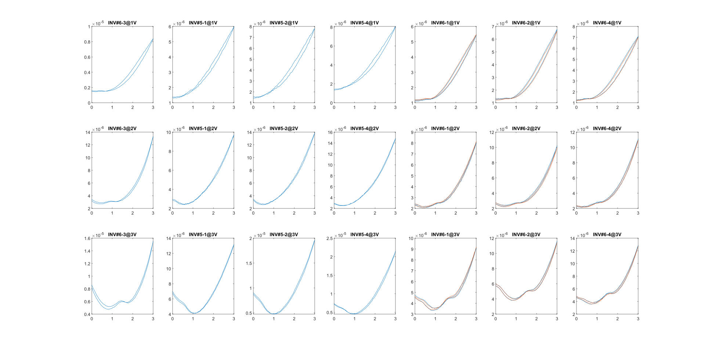

# BP_FET_Jan11_SIM

## ``import_FET_data.m``

 import FET data

## ``import_INV_data.m``

 import INV data

## ``interp2_script.m`` 

recalls ``write_fet_func.m`` to write lookup table FET models ``fet_funcxx.m``

## ``fet_func_inv_test.m``

solving INV equations and obtains the solutions to be plotted in 

## ``compare.m``

compares the VTC of INV

